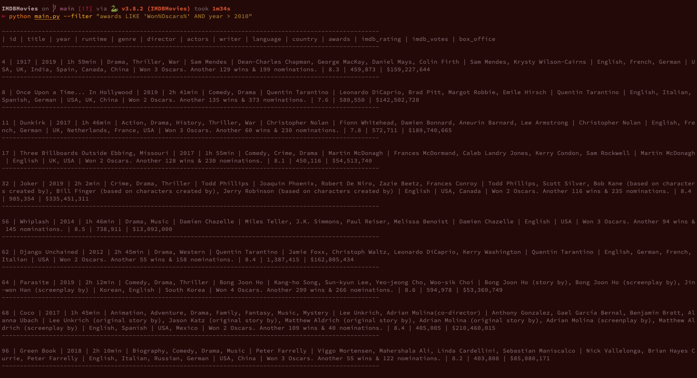

### What does this script do:
Uses [OMDB API](https://www.omdbapi.com/) to create database and interacts with it.

### How to use it:
1. Make sure, you have all dependencies requirements by this script - you can use `requirements.txt`  file or `Pipfil`. 

2. Generate your own [OMDB API](https://www.omdbapi.com/apikey.aspx).

3. Set your API key as OMDB_API_KEY env variable (script check env variable OMDB_API_KEY). Example [tutorial](https://www.serverlab.ca/tutorials/linux/administration-linux/how-to-set-environment-variables-in-linux/) --> look for `Persisting Environment Variables for a User` paragraph

* Tip for pipenv users: just create `.env` file in project directory and save this env var in it. For example: `OMDB_API_KEY='26d31b9c'`

4. Run a script for first time with no arguments to create local database file: 

        python main.py
    
    or via your IDE. You should get: `Database in path: 'database/movies.db' has been created! Please read project ReadMe.md in order to learn avaible commands.`
    
5.Have fun with script - see next paragraph for available commands
  
*6. (OPTIONAL) Populate your database with prepared movies sample (add movies from .txt file)
 
     python main.py --add from_file     
     
### Available commands:
1. Add movie/-s

    Add given movie or movies to database. There is also option to add movies from (prepared) txt file 
    (movie_titles_to_populate_db.txt) - just erase current content or append yours.
    
        python main.py --add "Monty Python and the Holy Grail"
        
        python main.py --add "Monty Python and the Holy Grail" "Monty Python's Life of Brian" "The Matrix"
        
        python main.py --add from_file
    
2. Sort and display movies

    Sort movies by given criteria (table name and sort order). You can also use sort by multiple columns 
    (although it is still pass as one argument). Syntax is like in sql ORDER BY clause. Your 
    sort_criteria will be validate by regex, so in order to have full grasp you can check this in code 
    (microservices/movie_sorter.py, line 17 -23).
    
        python main.py --sort "title desc"
        
        python main.py --sort "year desc, title, box_office asc"
    
3. Filter and display movies
    
    Filter movie by given criteria, it has to be pass as single argument - uses double quotes (think about passing
    pattern for LIKE operator), it has to have syntax like sql conditions in WHERE clause with some limitations:

     -> only LIKE operator for text searching
     
     -> no IN operator for numerical values
     
     -> for safety reasons value part (WHERE <column_name operator <b>value</b>>) can have up to 15 chars and no spaces are 
     allowed
     
     Similar to sorting, your filter_criteria will be validate by regex, so in order to have full grasp you can check 
     this in code (microservices/movie_filter.py, line 15 - 19).

        python main.py --filter "year > 2015"
  
        python main.py --filter "language LIKE '%Spanish%'"
    
        python main.py --filter "awards LIKE 'Won%Oscars%' AND year > 2010"
    
4. Display highscores movies

    Display ~~4 movies~~ 3 movies, one from each of ~~4~~ 3 predefined categories - longest movie, ~~movie with highest earnings~~, movie with
    most Oscars won and movie with highest imdb_rating.
    
        python main.py --highscores
        
    **IMPORTANT --> apperently API policy of Imdb has been changed - if you use instruction above you are unable to receive box_office value (other than 'N/A') from API request.This means that you cannot find highest earinings (all value are 'N/A'). Because of this highscores movies function no longer return movie with highest earnings.**
 
 
