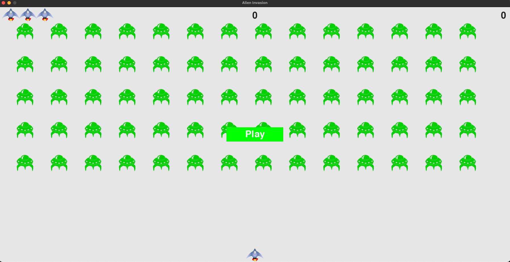

# PoorChickenInvaders
1) Make sure to use Pipfile (pipenv) or requirements.txt to install all dependencies.
2) Run `python main.py` in project directory --> after few seconds the new window with game should open.

* `Space` --> fire
* `Left arrow` --> move left
* `Right arrow` --> move right
* `q` --> quit game

3) Enjoy!

