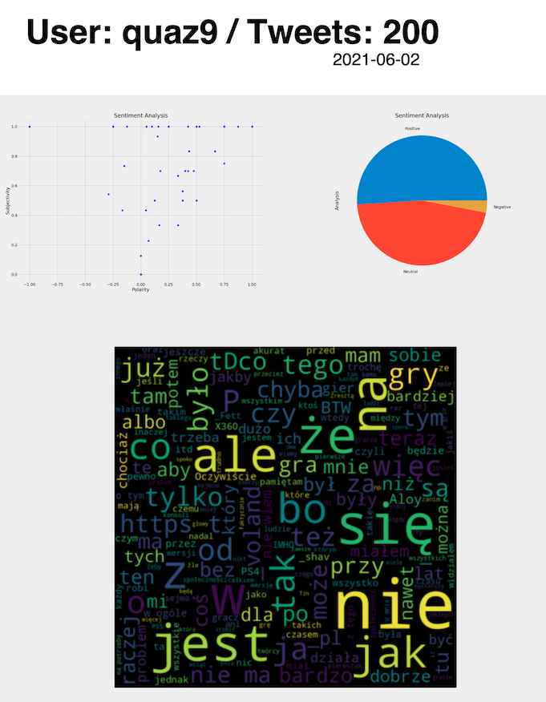

<details open="open">
  <summary>Table of Contents</summary>
  <ol>
    <li><a href="#what-does-this-script-do">What does this script do</a></li>
    <li><a href="#getting-started">Getting Started</a></li>
    <li><a href="#license">License</a></li>
  </ol>
</details>

### What does this script do:
Perform sentimental analysis on given dataset from twitter (specified numer of tweets from specified twitter user) and produce pdf raport (`pdfs/`).


  
## Getting Started

### Installation and run server on local machine
Prerequisites:
 * Python
 * pip
 
1. Clone repo 
   ```
   cd ~/to/folder/where/you/want/clone/this/repo
   https://github.com/blazejdobek/_python_twitter_sentimental_analysis.git
   ```
2. Setting up project environment (require venv)
   ```
   python3 -m venv /path/to/new/virtual/environment
   source <path_to_created_venv>/bin/activate
   pip install -r requirements.txt
   ```
3. Enjoy!
   ```
   python main.py <twitter_username> <num_of_posts_to_analyse> # python main.py quaz9 100
   python main.py -h
   ```
4. (Optional) Set up chron to automatically run task on given time
  * `crontab -e` # opens text editor (vim knowledge required!), and save line below to this file
  * `30 21 * * 0 cd <full_path_to_repo> && <full_path_to_repo>/venv/bin/python main.py <twitter_username> <num_of_posts>`
    * e.g. `30 21 * * 0 cd /Users/bajek/Downloads/_python_twitter_sentimental_analysis/ && /Users/bajek/Downloads/_python_twitter_sentimental_analysis/venv/bin/python main.py quaz9 100` ( this script will be automatically run every sunday at 21.30)
  * `crontab -l` # to confirm that your scirpt is on the scheduled tasks list
  * useful resource: [crontab guru](https://crontab.guru/#30_21_*_*_0)
## License

Distributed under the MIT License. See `LICENSE` for more information.

----

Future development ideas:
* add sentiment average over time (chart)
* save data to .json file / use orm and save this to db, play with mongoDB
* explore [pandas](https://www.youtube.com/playlist?list=PL-osiE80TeTsWmV9i9c58mdDCSskIFdDS), [matplotlip](https://www.youtube.com/playlist?list=PL-osiE80TeTvipOqomVEeZ1HRrcEvtZB_) and [numpy](https://www.youtube.com/watch?v=GB9ByFAIAH4)
* pytest
* use [snscrape library](https://github.com/JustAnotherArchivist/snscrape)
